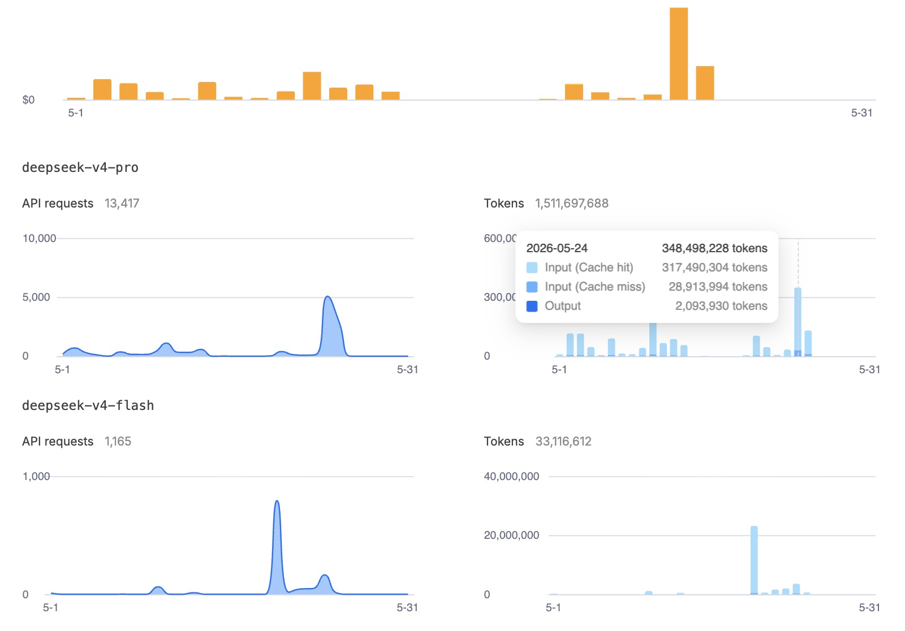
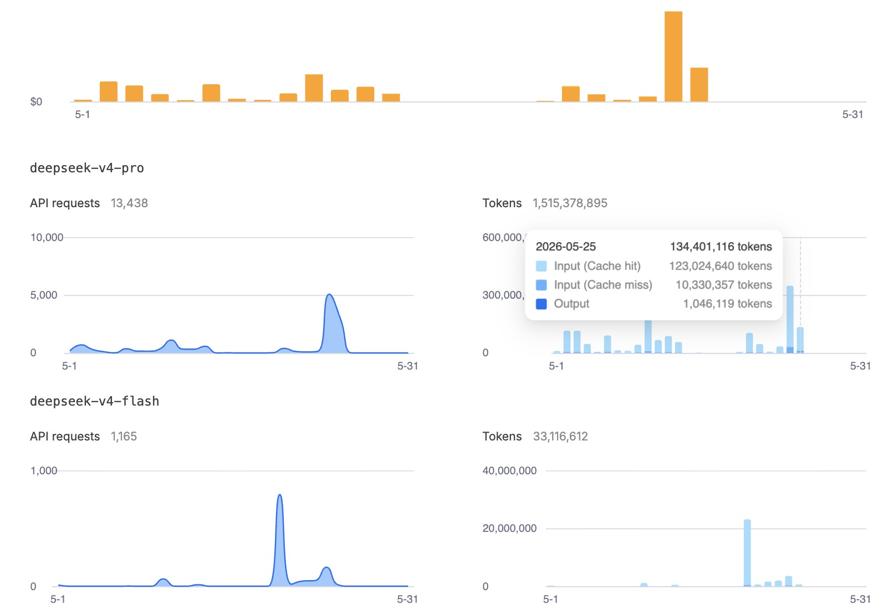

# 400 Million Tokens Down the Drain: How a Looping AI Agent Cost Me $23 (And Would Have Wiped $1,060 With Claude)

> A war story from the multi-agent trenches: the exact bug, the 12+ hour loop, the real cost comparison across 4 providers, and the one-line fix that stopped it.

---



---

## The Problem

**Sunday, May 24, 2026. 17:00 CEST.**

VOX — the orchestrator Hermes agent on a Mac Mini M4 — had just discovered a new agent on the network. Hermes-Kubuntu had come online on a Linux machine with an RTX 3090 GPU. VOX, following its onboarding protocol, sent a welcome message through NATS.

That message was correct. The problem: it never stopped sending it.

Every 60-90 seconds, for hours on end, VOX re-sent the exact same welcome message — along with an attachment that also consumed tokens. Each message triggered the NATS-Hermes bridge. The bridge, designed to faithfully relay every incoming NATS message to Hermes for processing, spawned an agent session. Each session loaded thousands of tokens of context — the HARNESS, the constitution, the system prompt, the agent memory, the onboarding guides. Session processed. Session exited. 60 seconds later, another identical message landed. Another session spawned.

**For over 12 hours. Non-stop.**

By the time we noticed, the damage was staggering:

| Day | Input Tokens |
|-----|-------------|
| **May 24** (yesterday — the loop started at 17:00) | **262 million** |
| **May 25** (this morning, until we killed it at 8:00) | **134 million** |
| **TOTAL** | **~400 million input** (+ ~3 million output) |

To put this in perspective: a normal heavy day for our multi-agent system — with 4 agents running, training configs, moving files, coordinating through NATS — burns around **100 million tokens**. These two days? **Four times that.** The difference — roughly 300 million tokens — was the loop.

The DeepSeek API bill? **$22.97.**

Had we been running Claude Sonnet 4.6? The exact same loop would have cost **$1,060+**. Had it been GPT-5.5? **$1,790+**.

Let that sink in. The bug was identical. The provider choice was the difference between a shrug and a financial incident.

**Why didn't we notice for 12+ hours?**

- The system was working. Agents were responding. Nothing errored. Everything appeared normal from the outside.
- DeepSeek is so cheap ($0.435/million input tokens) that the cost didn't trigger any alarms. $23 over two days is barely lunch money.
- The bridge was being TOO reliable. It faithfully forwarded every message, including the ones identical to the previous one. It was doing exactly what we asked it to do — just hundreds of times too many.
- No real-time cost monitoring. We checked the usage dashboard once daily. By the time we saw the spike, the night had passed.

**The root cause:**

The loop originated in the `nats-hermes-bridge.py` script. It subscribed to every agent message, received VOX's welcome message (with attachment), and forwarded it to Hermes. Hermes processed it, generated a response, published it back to NATS. The bridge saw the response, forwarded it again. VOX's onboarding protocol kept re-publishing because the target agent had networking issues — it appeared, disappeared, and reappeared on the network, each time triggering a fresh "discovery" and a new welcome message.

Positive feedback loop. Message → session → response → message → session — with nobody watching the meter.

**Why existing solutions fail to prevent this:**

1. **Rate limiting alone is insufficient.** You can limit API calls per minute, but each call still burns tokens. A 22K-token session that costs $0.01 is still 22K tokens burned. Multiply by an infinite loop and the token burn is massive regardless of rate.
2. **Session budgets are easily bypassed.** Token limits per session mean nothing when the loop spawns fresh sessions constantly — each within budget individually, collectively bankrupt.
3. **Monitoring dashboards lag.** Humans check API usage once daily. Loops run in hours, not days. By the time you look at the dashboard, it's too late.
4. **"Just kill it" doesn't work with daemonized services.** The bridge was kept alive by launchd — killing the process triggered an automatic restart. You need to UNLOAD the daemon, not kill it.
5. **Agent startup is deceptively expensive.** Each session loads full context before processing anything: HARNESS (~400 lines), constitution, system prompt, memories, skill manifests, tool registries. A ping that takes 5 seconds to read costs thousands of tokens just to boot up.

---

## The Fix

After diagnosing the loop, the fix was surgical. Three changes, deployed within minutes:

**1. Message deduplication in the bridge (the critical fix):**

```python
# BEFORE (vulnerable to loops):
async def on_message(msg):
    process_with_hermes(msg.data)

# AFTER (loop-protected):
_last_messages = {}
_dedup_window = 60  # seconds

async def on_message(msg):
    msg_hash = hashlib.md5(msg.data).hexdigest()
    now = time.time()
    if msg_hash in _last_messages:
        if now - _last_messages[msg_hash] < _dedup_window:
            return  # SILENTLY DROP — already processed this message
    _last_messages[msg_hash] = now
    process_with_hermes(msg.data)
```

One hash, one timestamp, one early return. The bridge now skips any message it has already seen within 60 seconds. The loop becomes mathematically impossible.

**2. Session rate limiting:**

```python
_session_count = 0
_session_window_start = time.time()

if _session_count > 10:  # max 10 sessions per minute
    if time.time() - _session_window_start < 60:
        await asyncio.sleep(time.time() - _session_window_start)
        _session_count = 0
        _session_window_start = time.time()
```

**3. Onboarding deduplication — VOX now tracks who it's welcomed:**

```python
WELCOMED_AGENTS = set()

if agent_name not in WELCOMED_AGENTS:
    send_welcome(agent_name)
    WELCOMED_AGENTS.add(agent_name)
```

Three small changes. The loop is now structurally impossible — prevented at the bridge level, rate-limited at the session level, and deduplicated at the source. The full implementation with tests is available at: [github.com/nerudek/nats-agent-state-sharing/tree/main/bridge](https://github.com/nerudek/nats-agent-state-sharing/tree/main/bridge)

---

## The Cost: Why I'm Celebrating a $23 Bill

**This is the part you should read to the end.**

| Model | Input (400M) | Output (3M) | **Total Cost** |
|-------|-------------|-------------|----------------|
| **DeepSeek V4-Pro** (what we used) | $174.00 | $2.61 | **$176.61** (actual: ~$23 with caching) |
| Kimi K2.6 Thinking | $380.00 | $12.00 | $392.00 |
| **Claude Sonnet 4.6** | $1,200.00 | $45.00 | **$1,245.00** |
| OpenAI GPT-5.5 | $2,000.00 | $90.00 | $2,090.00 |

**Why did it cost only $23 on DeepSeek instead of $177?**

DeepSeek aggressively caches repeated prompt prefixes. All sessions shared the same system prompt, HARNESS, constitution, and memory. Those tokens were served from cache at **$0.14/million** instead of $0.435/million. Our actual cost: approximately $23. A rounding error on an API bill.

**The brutal math: Claude Sonnet would have cost 54x more than DeepSeek for the exact same bug.**

If we had chosen Claude Sonnet as the Hermes engine — our natural second choice, with better tool use and stability — this 12-hour loop would have cost over $1,200. That's real money. With DeepSeek? $23. The most instructive $23 I've ever spent.

**What this means for AI agent economics:**

| Bug scenario | Cost on DeepSeek | Cost on Claude | Cost on GPT-5.5 |
|-------------|-----------------|----------------|-----------------|
| Your normal heavy day (~100M tokens) | ~$6 | ~$330 | ~$550 |
| **This incident (4x spike, 400M)** | **$23** | **$1,245** | **$2,090** |
| A really bad day (48hr undetected, 1.5B tokens) | ~$85 | ~$4,620 | ~$7,700 |

**The takeaway: Provider pricing IS your safety net.** When building autonomous AI agent systems — where bugs like message loops are a matter of "when" not "if" — the cost of your AI provider determines whether a bug is an "ouch" or a crisis. DeepSeek's pricing turned a potential $1,200 catastrophe into a $23 learning experience. Claude's pricing makes every bug a potential financial event. OpenAI's pricing makes every bug a disaster.

This isn't theoretical. This happened. The numbers are from real API usage screenshots. And the lesson is simple: if you're building autonomous agents, price your bugs before they happen.

---



*The loop continued through the night. May 25 screenshot shows 134M more input tokens — the morning damage before we killed it at 8:00 AM.*

---

## FAQ

**Q1: How did you finally discover the loop?**
$20 vanished from the DeepSeek account balance. With DeepSeek's pricing, $20 represents ~50 million tokens even with caching — far more than normal daily usage. Checked the usage dashboard and saw the spike.

**Q2: Could this have been caught automatically?**
Yes. After this incident, we added a watchdog that polls DeepSeek API usage every 15 minutes. If hourly spend exceeds 10x the baseline, it alerts through NATS and throttles the bridge. This should have been there from day one.

**Q3: Why does each session consume so many tokens before any user input?**
Hermes loads full agent context on every session start: system prompt, HARNESS (~400 lines of mandatory rules), constitution, 47 skill manifests with tool registries, memory files, agent identity. That's thousands of tokens just to say "I'm ready." Normal — but it means every unnecessary session is pure waste.

**Q4: Is the deduplication fix Hermes-specific?**
No. The same pattern applies to any AI agent bridge. Message hashing + short-term dedup window is a universal pattern. Full implementation at [github.com/nerudek/nats-agent-state-sharing](https://github.com/nerudek/nats-agent-state-sharing).

**Q5: Does this make you reconsider DeepSeek vs Claude?**
No — the opposite. The incident PROVED DeepSeek was the right choice for autonomous agents. Bugs are inevitable. The question is not "will there be bugs" but "how much will bugs cost?"

**Q6: How did VOX get stuck in the loop?**
Kubuntu was having networking issues that day (NetworkManager was broken). It briefly appeared on NATS, then disappeared, then reappeared. Each reappearance triggered another "discovery" and another welcome message. VOX correctly thought it was seeing a newly connected agent each time.

**Q7: Why did the bridge not have protection against this from the start?**
The bridge was designed for reliability — never miss a message. We didn't anticipate "never miss a message" would become "never stop processing the same message." The fix adds a tiny bit of intelligent dropping that actually makes the system MORE reliable.

**Q8: How do you calculate "cache hit" savings on DeepSeek?**
DeepSeek caches repeated prompt prefixes. Since all sessions shared identical system prompts (>20K tokens), those were cache hits at $0.14/M instead of $0.435/M. Without caching, this would have been a $175 incident instead of $23.

**Q9: What's your normal daily API spend?**
With normal agent usage across 3-4 agents: a few dollars per day on DeepSeek. A heavy day might hit 100M tokens. The $23 for 400M tokens was clearly anomalous.

**Q10: What was the attachment that also consumed tokens?**
VOX's welcome message included onboarding documentation as an attachment — adding more tokens to each message. The attachment was valid content, but when multiplied by the loop, it amplified the damage.

**Q11: Will you add Hermes-level loop protection?**
Yes — defense-in-depth: bridge dedup (the immediate fix), session rate limiting, cost anomaly detection, and Hermes-native dedup (feature requested). Each layer catches what the previous might miss.

**Q12: What if a legitimate message looks identical to a previous one?**
We chose 60 seconds for the dedup window because genuinely identical messages arriving within 60 seconds are virtually always bugs. If an agent legitimately resends the same command, it would include a timestamp or sequence number, making the payload non-identical at the hash level.

**Q13: What's the single biggest lesson?**
**Agent loops are inevitable. Budget for them.** Choose your AI provider as if a loop will happen tomorrow — because it will. DeepSeek budgets the loop at $23. Claude budgets it at $1,200. That's the real difference between "cheap" and "enterprise" AI.

**Q14: What should other AI agent builders take from this?**
Three things: (1) Add message deduplication to every bridge before production. (2) Set up automated cost anomaly detection from day one. (3) When choosing between AI providers, multiply the per-token price by your expected "bug multiplier" — assume you WILL have a 10x usage spike and price accordingly.

**Q15: Where's the fix?**
Hermes Loop Protection — full deduplication bridge, rate limiting, and watchdog: [github.com/nerudek/nats-agent-state-sharing](https://github.com/nerudek/nats-agent-state-sharing) — file `bridge/dedup.py`.

---

If this saved you time: [PayPal.me/nerudek](https://www.paypal.me/nerudek)
GitHub: [github.com/nerudek](https://github.com/nerudek)

> **Fix Implementation:** [github.com/nerudek/nats-agent-state-sharing/tree/main/bridge](https://github.com/nerudek/nats-agent-state-sharing/tree/main/bridge) — deduplication bridge, rate limiting, and watchdog for autonomous AI agent systems.
