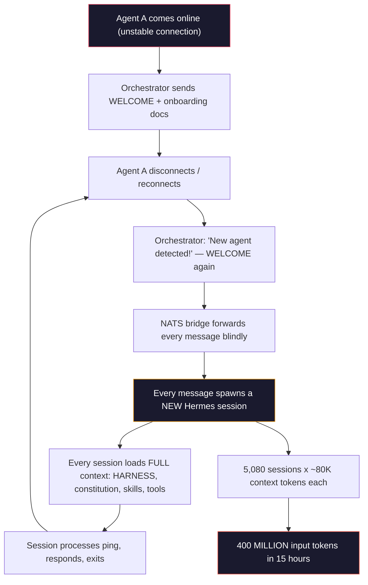
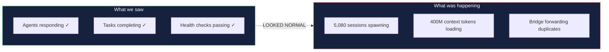
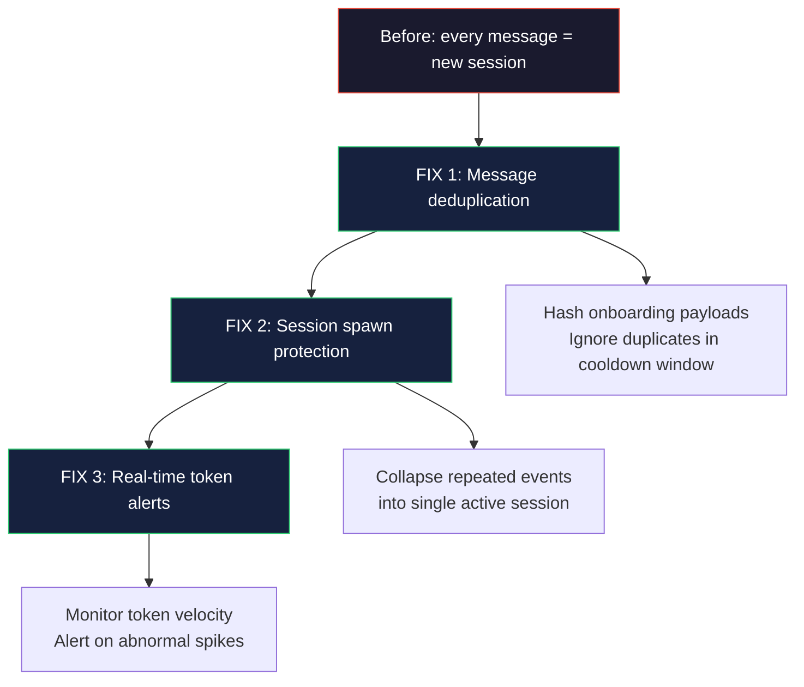

# 400 Million Tokens Burned Overnight — A Multi-Agent AI Postmortem

[](https://opensource.org/licenses/MIT)

**What happens when an AI agent onboarding loop burns 400M tokens in 15 hours — and why your provider choice is a $1,200 question.**

---

> 5,080 API requests. Zero crashes. Zero alerts. Everything looked normal. And $1,200+ worth of tokens disappeared into a bridge with no deduplication layer.

---

## The problem



Multi-agent AI systems fail differently than traditional software. A single missing deduplication check — not a crash, not a bug, not a logic error — created a positive feedback loop that burned 400 million tokens across 5,080 API requests. The system worked perfectly. It just silently set money on fire.

The difference between a $23 mistake and a $1,245 mistake? Which AI provider you picked.

---

## What happened

Sunday, May 24, 2026. An orchestrator agent on a Mac Mini M4 discovered a new agent on the network — a secondary agent coming online on a Linux machine with an RTX 3090 GPU.

Following standard onboarding protocol, the orchestrator sent a welcome message through NATS along with onboarding documentation. That message was correct.

**It just never stopped sending it.**

Every 60-90 seconds, the orchestrator re-sent the same onboarding payload. The bridge forwarded every message faithfully. Each message spawned a fresh agent session loading the full startup context — HARNESS, system prompts, constitution, memory, tool registry, skill manifests, runtime instructions. Thousands of tokens per session. 5,080 times.

### The numbers

| Metric | Value |
|--------|-------|
| Input tokens consumed | ~400 million |
| Output tokens | ~3 million |
| API requests | 5,080 |
| Runtime | ~15 hours |
| Sessions spawned | 5,080 |

### Why nobody noticed for 15 hours



1. **The system was technically working** — messages flowed correctly, agents replied, tasks completed
2. **Agent startup is deceptively expensive** — most burn came from context loading, not model output. A tiny ping triggered tens of thousands of input tokens
3. **Per-session budgets were useless** — each session stayed within limits, but the loop spawned infinite new sessions
4. **Rate limiting didn't help** — even throttled, every request still consumed context. A slow infinite loop is still infinite
5. **Daily dashboard checks lagged** — by the time usage was checked, the loop had been running all night
6. **Killing the process restarted it** — the bridge was managed by launchd. Killing it spawned a new instance. The daemon had to be fully unloaded

---

## Root cause

The cascade came from a three-way interaction:

```
Network discovery → onboarding retries → bridge with zero deduplication
```

The secondary agent had unstable connectivity during onboarding. It repeatedly appeared and disappeared from the network. Each rediscovery triggered another welcome event. The bridge forwarded every event. The agent processed each as brand-new.

## The fix (3 changes, <50 lines)



1. **Message deduplication** — the bridge hashes incoming onboarding payloads and ignores duplicates within a cooldown window
2. **Session spawn protection** — repeated onboarding events from the same agent are collapsed into a single session
3. **Real-time token monitoring** — if token velocity spikes abnormally, the bridge alerts immediately

Implementation: [nats-agent-state-sharing/bridge](https://github.com/nerudek/nats-agent-state-sharing/tree/main/bridge)

---

## The cost — provider comparison

> Same bug. Same 5,080 requests. Same 400M input tokens. Only the API provider changed.

| Provider | Estimated Cost | % of Monthly Budget |
|----------|---------------|---------------------|
| **DeepSeek** | **$22.97** | ~5% of a $450 plan |
| Moonshot Kimi | ~$392 | ~39% of a $1,000 plan |
| Anthropic Claude Sonnet | ~$1,245 | ~125% of a $1,000 plan |
| OpenAI GPT-5-class | ~$2,090 | ~209% of a $1,000 plan |

That's the difference between *"well... that was horrifying"* and *"we need to explain this to accounting."*

Provider pricing isn't just about cost optimization — it's insurance against infrastructure bugs that silently burn resources.

---

## Why not just [alternative fix approach]?

| Alternative | Problem | Why it fails |
|-------------|---------|-------------|
| Rate limiting alone | Every request still consumes context tokens | A slow infinite loop is still infinite. Rate limiting slows the burn, doesn't stop it |
| Per-session token budgets | Each session stays within limits | The bug spawns NEW sessions. Budgets per session are irrelevant |
| Kill the process | launchd restarts it automatically | You have to know to UNLOAD the daemon, not just kill the process |
| Daily dashboard monitoring | 15-hour lag between check and detection | Real-time alerts are the only reliable defense for token-burn bugs |
| Skip onboarding retries | Legitimate retries are needed for unstable connections | The fix is deduplication, not removing retries entirely |

---

## Stats and context

- **400 million input tokens** — equivalent to processing the entire Harry Potter series ~400 times
- **5,080 API requests** in 15 hours — roughly one every 10 seconds
- **$1,200+ potential cost difference** between cheapest and most expensive provider for the identical bug
- **3 lines of code** stopped the loop: a hash check, a cooldown window, and a session collapse
- **0 visible failures** during the entire incident — the scariest part

---

## Quick start

This repo is a postmortem article. There's no software to install — the fix is documented for your own agent systems.

```bash
# Read the postmortem
cat README.md

# The fix implementation lives here:
git clone https://github.com/nerudek/nats-agent-state-sharing
```

**What you can take from this:**
1. If you run multi-agent systems, add message deduplication to your bridge TODAY
2. If you use launchd/systemd for agent daemons, know the difference between kill and unload
3. If you check token usage daily, add a real-time velocity alert
4. If you pick an AI provider, factor in "bug insurance" — not just base pricing

---

## Installation

No installation. This is a postmortem.

To implement the fix for your own system, see the [bridge deduplication code](https://github.com/nerudek/nats-agent-state-sharing/tree/main/bridge) in the companion repo.

---

## Repository structure

```
hermes-token-loop-postmortem/
├── README.md              # THIS FILE — the full postmortem
├── SKILL.md               # Agent skill file for reference
├── banner.png             # Cover image
├── cover.png              # Social preview
├── usage-may24-yesterday.jpg  # Dashboard screenshot (262M tokens)
└── usage-may25-today.jpg      # Dashboard screenshot (134M tokens)
```

---

## Known problems

| Problem | Status | Notes |
|---------|--------|-------|
| Deduplication adds latency (~5ms per message) | By design | Hash computation is negligible. Acceptable trade-off for loop prevention |
| Cooldown window can mask legitimate re-onboarding | Mitigated | Window is configurable per agent. Default: 5 minutes |
| Token velocity alerts can false-positive during batch operations | Open | Tune threshold per workload. PRs welcome |

---

## Contributing

Have you survived a similar loop? Open an issue or PR with your story. Multi-agent failure modes are under-documented — the more postmortems we share, the fewer people rediscover the same bugs.

- **Similar incidents:** Open an issue with the `incident-report` label
- **Fix improvements:** PR to the [nats-agent-state-sharing](https://github.com/nerudek/nats-agent-state-sharing) repo
- **Cost comparison data:** PR with additional provider pricing

---

## License

MIT — see [LICENSE](LICENSE).

---

*Built by [nerudek](https://github.com/nerudek)* — May 2026

☕ **Support:** [PayPal.me/nerudek](https://www.paypal.me/nerudek) | [Dev.to](https://dev.to/nerudek)
